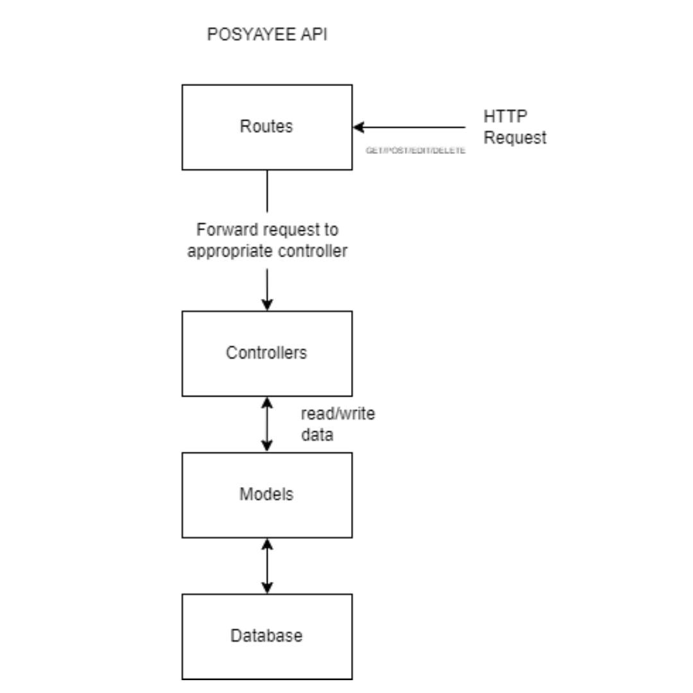

# POSYAYEE API 

#### หลักการทำงาน


```
 git clone https://github.com/boytur/POSYAYEE-API.git
```
```
 cd POSYAYEE-API
```
```
 npm install
```
#### Add .env file 
```
PORT = YOUR_PORT
MONGO_DB_URI = YOUR_MONGO_DB_URI
JWT_SECRET = YOUR_JWT_SECRET
TOKEN = YOUR_LINE_NOTIFY_TOKEN
```
```
 mkdir uploads
```
```
 npm start
```
#### อัพเดตครั้งที่ 1
 - เปลี่ยนวิธีเก็บข้อมูลจากลิงก์เป็นอัพโหลดเก็บที่ server และเก็บ path เข้า db เนื่องจากพอเก็บเป็นลิงก์ลง db แล้วความเร็วการดึง API ช้ามากและ db บวม
